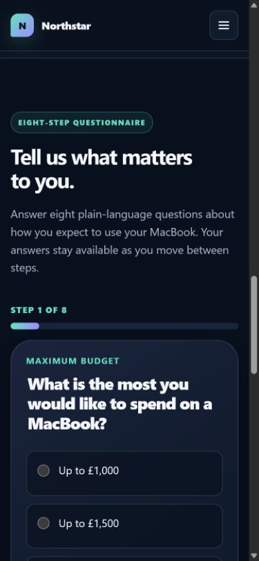
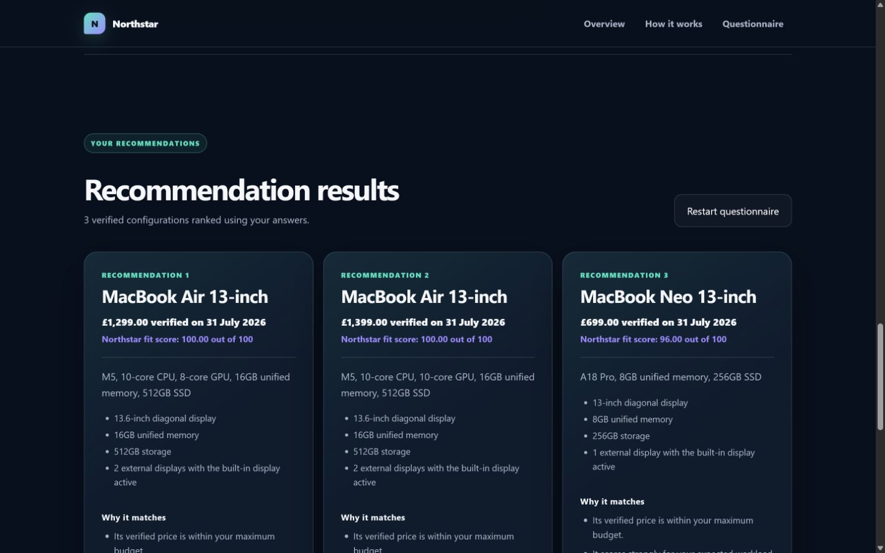

# Northstar

Northstar is an unofficial student portfolio project that helps people choose a MacBook without
requiring them to decode chip names or benchmark charts. An eight-step questionnaire applies hard
requirements first, then uses a transparent scoring model to explain up to three focused matches.

> **Independent project:** Northstar is not affiliated with, endorsed by or sponsored by Apple
> Inc. Apple and MacBook are trademarks of Apple Inc. Product facts come from official Apple UK
> pages. Suitability scores, reasons and compromises are Northstar project judgements.


**Deployment target:**
[`taufeeqahmed-dev.github.io/apple-product-recommender`](https://taufeeqahmed-dev.github.io/apple-product-recommender/)
(publishes from `main` after the Stage 4 review is approved).

## Why this project exists

MacBook ranges are usually described through specifications. Northstar starts with the visitor's
budget, work, portability, screen, storage, display and ownership needs instead. It keeps verified
facts separate from project-authored suitability judgements and shows why a result ranked well,
where it compromises, and when no verified configuration meets every hard requirement.

## Features

- Eight-step, plain-language questionnaire using native form controls.
- Keyboard-aware focus movement, required-answer alerts and answer preservation.
- Validated catalogue of 10 exact Apple UK configurations, verified on 31 July 2026.
- Hard filters for market, availability, data completeness, budget, storage, displays and workload.
- Deterministic, normalized 100-point scoring with explicit tie-breaking.
- Right-sized light/moderate workload scoring while preserving an explicit performance-first choice.
- Up to three semantic result cards with dated prices, facts, reasons and compromises.
- Safe invalid-input, invalid-catalogue and no-match states.
- Responsive, reduced-motion-aware interface with no framework or runtime dependency.

## Interface

| Mobile questionnaire | Explainable desktop results |
| --- | --- |
|  |  |

## How recommendations work

Northstar validates the entire catalogue and all answer IDs before doing any matching. Products
that fail a hard requirement are excluded; hard requirements are never silently relaxed.

Eligible products are scored with these Northstar-authored weights:

| Component | Weight |
| --- | ---: |
| Workload fit | 30 |
| Primary-use fit | 25 |
| Portability versus performance | 20 |
| Screen-size preference | 15 |
| Ownership-period headroom | 10 |

Optional “unsure” or “no preference” components are omitted and the score is normalized over the
remaining applicable weight. Ties resolve by score, workload, primary use, balance, number of
compromises, price and stable product ID. The result order is deterministic.

The detailed matrices, formula, right-sizing correction, reason selection and pseudocode are in
[the algorithm documentation](docs/algorithm.md).

## Architecture

```text
index.html
  ├─ js/questionnaire.js ── js/questionnaire-state.js
  ├─ js/app.js
  │    ├─ js/products.js ── js/product-schema.js
  │    ├─ js/recommendation-rules.js
  │    └─ js/recommendation-engine.js
  ├─ js/results.js
  └─ js/ui.js
```

- `js/products.js` contains verified Apple facts only.
- `js/product-schema.js` validates and freezes the full catalogue.
- `js/recommendation-rules.js` contains Northstar thresholds and suitability matrices.
- `js/recommendation-engine.js` is pure and deterministic.
- `js/results.js` owns accessible result rendering.
- `js/questionnaire-state.js` keeps questionnaire state private and returns immutable snapshots.

There is no backend, account, analytics, persistent storage, build step or production dependency.

## Product-data boundaries

Version one compares 10 approved base configurations from the MacBook Neo, MacBook Air and MacBook
Pro ranges. Each record includes a stable ID, `GB`/`GBP`, exact dated price, availability,
configuration facts and field-level official sources. Missing facts remain `null`; configurable
upgrades are not inferred or added.

Prices are snapshots verified on **31 July 2026** and can change. Product facts are Apple-sourced;
all capability bands, fit scores, reasons and compromises are independent Northstar judgements.

## Accessibility

The interface uses semantic landmarks, fieldsets and native controls; visible focus states; a skip
link; associated error messages; numeric progress; deliberate heading focus; polite result status;
and reduced-motion support. Stage 4 also adds programmatic invalid states, distinguishable result
and source-link names, JavaScript-failure guidance and Escape cancellation for restart confirmation.

Automated results do not replace assistive-technology testing. Safari/iPhone, VoiceOver, Narrator
and physical keyboard/device checks remain explicitly listed for user-assisted verification in
[the test report](docs/testing.md).

## Testing

The dependency-free test command is:

```text
npm test
```

It runs:

```text
node --test
```

The current suite contains 22 data, engine and recommendation-quality tests. It covers schema
validation, immutability, exact configurations, boundaries, ties, malformed input, no-match output,
normalization, deterministic ordering, right-sized scenarios and monotonic hard requirements.

Stage 4 local Lighthouse baseline and post-fix results, browser coverage, viewports, accessibility
checks, defects and pending manual checks are recorded in [the test report](docs/testing.md).

## Run locally

The site uses JavaScript modules, so serve the repository root rather than opening `index.html`
directly. No installation or build is required.

```text
python -m http.server 4173 --bind 127.0.0.1
```

Open `http://127.0.0.1:4173/`. On Windows, `py` can be used when that launcher is configured.

## Deployment

`.github/workflows/pages.yml` prepares a static `_site` artifact, runs the Node test suite, and uses
the official GitHub Pages actions. It triggers only from `main` (or manual dispatch), so this review
branch does not publish anything. After approval and merge:

1. Set **Settings → Pages → Source** to **GitHub Actions**.
2. Allow the `Deploy static site to Pages` workflow to finish.
3. Verify the HTTPS site and run production Lighthouse against the deployed address.

Relative CSS, module and asset paths have been checked from the repository subdirectory.

## Limitations

- Product facts and prices are dated snapshots and require future re-verification.
- Only 10 approved exact configurations are compared; upgrades are outside scope.
- Questionnaire state is memory-only and resets on reload.
- Budget is a hard eligibility rule, not a value-for-money score.
- No-match handling does not calculate or substitute near matches.
- Chrome, Firefox, Safari, physical-device and representative screen-reader checks require the
  environments listed in the manual verification checklist.
- There is no backend, persistence, analytics or user account.

## Portfolio material

The concise problem–approach–outcome narrative and CV-ready wording are in
[the portfolio case study](docs/portfolio-case-study.md). Release evidence is kept separately in
[the test report](docs/testing.md), so claims can be updated without obscuring the implementation.

## Current status

Stages 1–3 are complete, verified, committed and pushed. Stage 4 changes are prepared on
`stage-4-final-polish` and are awaiting review. They have not been committed, merged, pushed or
published.
