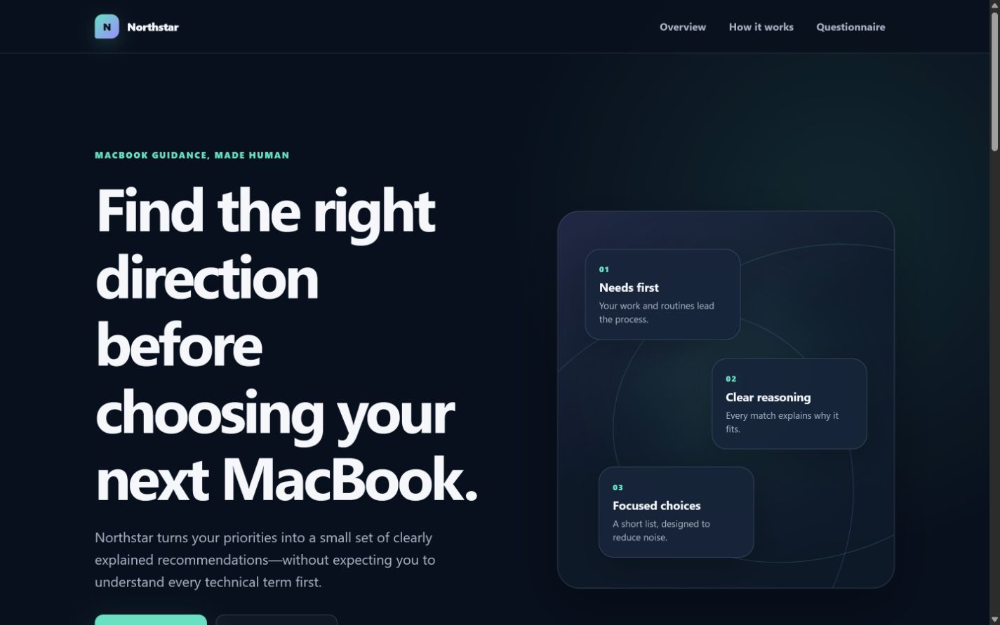

# Northstar

Northstar is an unofficial student portfolio project that helps people choose a MacBook without
requiring them to decode chip names or benchmark charts. Version 1.1 uses a streamlined adaptive
questionnaire, explicit must-have choices and transparent ranking explanations to produce a focused
shortlist.

> **Independent project:** Northstar is not affiliated with, endorsed by or sponsored by Apple
> Inc. Apple and MacBook are trademarks of Apple Inc. Product facts come from official Apple UK
> pages. Suitability scores, confidence, reasons and compromises are Northstar project judgements.



Northstar v1.0.0 is the currently released production version. It is live at
[`taufeeqahmed-dev.github.io/apple-product-recommender`](https://taufeeqahmed-dev.github.io/apple-product-recommender/),
and GitHub Pages deploys production automatically from `main`. Version 1.1 is the current release
candidate on `feature/adaptive-questionnaire-v1.1`; it will not become production until this branch
is merged into `main` and the Pages deployment succeeds.

## Why this project exists

MacBook ranges are usually described through specifications. Northstar starts with the visitor's
budget, local activities, multitasking, portability, screen, storage and genuinely essential needs.
It keeps verified facts separate from project-authored assessments and explains why a result ranked
well, where it compromises, why alternatives ranked lower and when no verified MacBook meets every
must-have requirement.

## Version 1.1 features

- Seven core questionnaire steps, with no more than two essential-detail follow-ups.
- A tailored multi-select activity step for study, programming, cybersecurity labs, photo/video
  editing, music production and 3D/engineering work.
- Plain-language questions with selection guidance and technical clarification in associated help.
- Multitasking assessment based on concurrent applications and browser tabs.
- Strict, flexible and stretch budget handling, with an optional absolute maximum.
- Ordinary preferences remain soft; only final Essential requirements selections activate workload,
  exact screen, exact weight or verified external-monitor filters.
- Combined portability/performance and screen controls, plus a clear minimum-storage step.
- Battery, connection and ownership-period questions are removed because they do not materially
  improve ranking with the current verified dataset.
- Exact, Closest and Stretch handling before a genuine No Match.
- High, Moderate or Low confidence only when an eligible recommendation exists.
- Compact grouped answer summaries, individual-answer editing and refreshed recommendations.
- Dependent answers are cleared and announced as soon as they are no longer relevant.
- Rich reasons, compromises and lower-ranked-product explanations.
- Keyboard-accessible, responsive comparison of the top three recommendations.
- Framework-free production HTML, CSS and JavaScript with no account, backend, analytics or runtime
  dependency.

## Questionnaire design

A typical journey covers:

1. Budget and flexibility
2. Main uses
3. Relevant workload activities
4. Multitasking
5. Portability/performance and screen preference
6. Storage
7. Essential requirements

Exact weight or external-monitor details appear only when the visitor explicitly marks them as
essential. Where several related activities can apply, Northstar uses multi-select controls rather
than forcing the visitor through several separate screens. Hidden or stale answers are cleared and
cannot influence recommendations.

## How recommendations work

Northstar validates the entire catalogue and all visible answer IDs before matching. Every product
must pass the catalogue, market and data-completeness checks; explicit hard requirements are then
applied before scoring. Ordinary preferences influence ranking without automatically eliminating an
otherwise suitable MacBook.

The result hierarchy is:

```text
Exact match
    ↓
Closest match
    ↓
Stretch match
    ↓
Genuine No Match
```

The configurable Northstar scoring weights are:

| Component | Weight |
| --- | ---: |
| Workload fit | 25 |
| Primary-use fit | 20 |
| Multitasking and memory | 15 |
| Portability and weight | 15 |
| Screen-size preference | 10 |
| External-display requirement | 5 |

Optional or inapplicable components are omitted and the score is normalized over the applied
weight. Ties resolve deterministically through ranking score, total fit, component order, number of
compromises, verified price and stable product ID.

The exact hard-filter rules, budget modes, scoring formula, classifications, confidence calculation
and output contract are in [the algorithm documentation](docs/algorithm.md).

## Architecture

```text
index.html
  ├─ js/questionnaire-definition.js
  ├─ js/questionnaire-profile.js
  ├─ js/questionnaire-state.js
  ├─ js/questionnaire.js
  ├─ js/app.js
  │    ├─ js/products.js ── js/product-schema.js
  │    ├─ js/recommendation-rules.js
  │    └─ js/recommendation-engine.js
  ├─ js/results.js
  └─ js/ui.js
```

- `js/products.js` contains verified Apple facts only.
- `js/product-schema.js` validates and freezes the full catalogue.
- `js/recommendation-rules.js` contains Northstar thresholds and suitability matrices.
- `js/recommendation-engine.js` remains pure and deterministic.
- `js/results.js` owns accessible result, answer-review and comparison rendering.
- `js/questionnaire-state.js` keeps state private and returns immutable snapshots.
- `js/version.js` versions the application, questionnaire schema and rules independently.

## Product-data boundaries

Northstar compares 10 approved exact MacBook configurations. Each record includes a stable ID,
`GB`/`GBP`, exact dated price, availability, configuration facts and field-level official sources.
Missing facts remain `null`; configurable upgrades are not inferred or added.

Prices are snapshots verified on **31 July 2026** and can change. Product facts are Apple-sourced;
all capability bands, fit scores, confidence, reasons and compromises are independent Northstar
judgements. Version 1.1 does not change the catalogue or any verified fact.

## Accessibility

The interface uses semantic landmarks, headings, native controls and dialogs; concise prompts with
associated help and errors; calm stage-based progress with exact counts available to assistive
technology; polite change/result announcements; deliberate focus placement; visible focus states;
keyboard-operable comparison; responsive reflow; and reduced-motion support. Recommendations appear
before secondary confidence and classification diagnostics. Per-product scores and ranking details
are available through native disclosures instead of competing with the recommendation. Terminal
no-match outcomes do not display confidence.

Playwright verifies key focus, keyboard and responsive behaviour, but automation does not replace
assistive-technology testing. Safari/iPhone, VoiceOver, Narrator, physical-device and deployed-site
checks remain listed in [the Phase 5 test report](docs/testing.md).

## Development and testing

The production application has no dependencies. Playwright is an exact-version development-only
dependency.

```text
pnpm install
pnpm test
pnpm check:syntax
pnpm test:browser
```

- `pnpm test` remains exactly `node --test` and currently runs 67 unit, data, migration, engine and
  recommendation-quality tests.
- `pnpm check:syntax` runs `node --check` over project JavaScript.
- `pnpm test:browser` runs nine Playwright tests across 1440×900 desktop, 768×1024 tablet and
  390×844 mobile projects.

The complete evidence, tool versions, Lighthouse scores and manual-check list are in
[docs/testing.md](docs/testing.md).

## Run locally

```text
pnpm serve
```

Open `http://127.0.0.1:4173/`. The development server exposes only the static public site paths.
No build step is required.

## Deployment

`.github/workflows/pages.yml` installs frozen development dependencies, runs unit tests and syntax
checks, installs Playwright Chromium, runs all browser projects, then prepares the static Pages
artifact. Production deploys from `main` using GitHub Pages; this feature branch cannot deploy.

Release gates and post-deployment verification are in [the v1.1 release checklist](docs/release-v1.1.md).

## Limitations

- Product facts and prices are dated snapshots and require future re-verification.
- Only 10 approved exact configurations are compared; upgrades are outside scope.
- Questionnaire state is memory-only and resets on reload.
- Battery and connection needs are outside the main questionnaire until verified model-specific data
  can use them meaningfully.
- Shareable result URLs are optional Phase 6 work and are not implemented.
- There is no backend, persistence, analytics or user account.
- Safari, VoiceOver, representative Windows screen-reader and physical-device checks require the
  environments listed in the release checklist.

## Portfolio material

The implementation narrative and CV-ready wording are in
[the portfolio case study](docs/portfolio-case-study.md). Release evidence is kept separately in
[the test report](docs/testing.md).

## Current status

Northstar v1.0.0 is the currently released, tagged and deployed production version. Northstar v1.1
is the current release candidate on `feature/adaptive-questionnaire-v1.1`; it is not yet merged,
tagged or deployed. It becomes the production version only after this feature branch is reviewed and
merged into `main` and the GitHub Pages deployment succeeds. Optional Phase 6 shareable results have
not begun.
