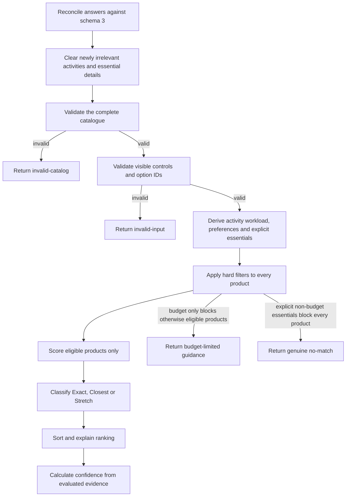

# Northstar v1.1 recommendation algorithm

| Versioned concern | Value |
| --- | --- |
| Application | `1.1.0` |
| Questionnaire schema | `3` |
| Recommendation rules | `2.1.0` |

These versions are independent. Schema 3 is the usability-tested seven-to-nine-step questionnaire;
rules 2.1 removes unsupported confidence caps and ownership-period scoring from active v1.1
recommendations.

Northstar separates sourced facts from project-authored assessments. Product prices, hardware and
source URLs live in `js/products.js`; capability bands, matrices, fit scores, classifications and
confidence logic are Northstar judgements, not Apple recommendations or performance claims.

## Processing flow



## Streamlined adaptive input

The questionnaire contains seven core steps:

1. budget target, flexibility and optional absolute maximum;
2. one or two primary uses;
3. a tailored multi-select activity step;
4. one multitasking question;
5. portability/performance balance and screen preference;
6. minimum storage; and
7. essential requirements.

Selecting essential maximum weight or external-display support adds one detail step for each. The
minimum path is seven steps and the maximum is nine.

Prompts use buyer-facing language. Short rules such as choosing up to two uses, selecting all
applicable activities and distinguishing an ideal budget from an absolute maximum are associated
with their controls as help text. Technical terms remain where they identify a real activity or a
verified product fact rather than an internal scoring concept.

Visible progress uses “Getting to know your needs”, “A few details left” and “Almost ready”. Exact
step and adaptive-total values remain associated with the native progress element and focused step
heading for assistive technology, but routine total changes are not live-announced.

Activity options declare the primary uses that make them relevant. Programming and cybersecurity
share one activity group, so selecting both does not duplicate Docker, local database, development
server, virtual-machine or local-AI choices.

Every answer change is reconciled before state is committed. Removing a use preserves activities
that remain relevant to another selected use and clears only the obsolete option IDs. Removing an
essential weight or display choice clears only its dependent detail. A stale hidden value is invalid
input and cannot reach profile derivation or scoring.

## Workload derivation

Each selected use supplies a baseline capability and memory signal. Each activity supplies another
signal, and multitasking supplies a concurrent-memory signal. Northstar takes the strongest
applicable capability and memory values; it does not add multiple activities together and inflate a
requirement merely because several related boxes were selected.

Examples introduced by schema 3:

| Activity | Capability band | Memory assessment |
| --- | ---: | ---: |
| Local development servers or databases | 2 | 16 GB |
| Docker or containers | 3 | 24 GB |
| One virtual machine | 3 | 16 GB |
| Two simultaneous virtual machines | 3 | 24 GB |
| Three or more simultaneous virtual machines | 4 | 36 GB |
| Larger local AI models | 4 | 36 GB |

Equivalent photo, video, music and 3D activities retain the previous v1.1 capability/memory
assessments. All values in this table are Northstar assessments.

The derived targets are preferences unless `workload` is selected in Essential requirements.

## Hard requirements

Every product first passes availability, `GB`/`GBP`, complete-data and known-chip checks. Visitor
answers add only these hard requirements:

| Answer | Hard-filter condition |
| --- | --- |
| Budget | Strict target, or a supplied absolute maximum for Flexible/Stretch |
| Storage | A known selected minimum; `unsure` adds no threshold |
| Workload and memory | `workload` is explicitly selected as essential |
| Weight | `maximum-weight` is essential and its verified maximum is supplied |
| Screen size | `exact-screen` is essential and a preferred size is selected |
| External displays | `external-displays` is essential and the verified count is supplied |

Portability balance and ordinary screen preference remain soft. “Let Northstar decide”, “No
preference” and “I’m not sure” do not create constraints. Battery, connections and ownership period
are not asked in the main questionnaire and cannot become filters.

## Budget and fallback behavior

- **No fixed target:** budget neither filters nor creates a Stretch classification.
- **Strict:** target is the hard maximum.
- **Flexible:** an optional absolute maximum is hard; within-target products form the main list and
  eligible over-target products form a separate Stretch list.
- **Stretch:** an optional absolute maximum is hard; eligible over-target products can enter the main
  ranking with the existing five-point adjustment.

The engine prefers eligible Exact, Closest and permitted Stretch results. A preference compromise
never causes No Match. If budget alone blocks otherwise eligible products, the result is
`budget-limited`. `no-match` means explicit hard requirements block every verified configuration;
Northstar does not silently relax them.

## Scoring

The numeric weights and fit matrices for the remaining active dimensions are unchanged:

| Component | Configured weight | Source |
| --- | ---: | --- |
| Workload | 25 | Strongest derived workload band × capability band |
| Primary uses | 20 | Average of one or two use/capability fits |
| Multitasking and memory | 15 | Derived memory target × verified memory band |
| Portability and weight | 15 | Portability/performance blend; essential weight can add target fit; omitted when Northstar is asked to decide and no weight is essential |
| Screen size | 10 | Exact/nearby marketed-size fit; omitted for no preference |
| External displays | 5 | Verified count fit when explicitly essential |

Ownership-period scoring is inactive in rules 2.1. The remaining configured weights deliberately
retain their previous numeric values. Inapplicable components have zero applied weight, and the
score is normalized over applied components:

```text
score = sum(component value × configured weight) / sum(applied weights)
```

This produces the same relative weighting those dimensions had when ownership was previously
unanswered. Scores are stored as integer basis points and exposed as percentages up to 100.

## Result classifications and ordering

- **Stretch-budget match:** eligible but above the preferred target.
- **Exact match:** within target, every applied component is at least 70 and no major compromise is
  present.
- **Closest match:** passes every hard requirement but contains a scored preference below 70 or a
  major explained compromise.

Ordering is deterministic by budget-adjusted ranking score, total fit, workload, primary uses,
multitasking/memory, portability/weight, screen, displays, fewer compromises, lower verified price
and stable product ID. Lower-ranked products report the deciding factor, largest deficit against the
leader and any material component advantage.

## Confidence

Confidence describes the evidence supporting an eligible ranking; it is not a probability that a
person will like a product.

| Contribution | Maximum |
| --- | ---: |
| Evaluated answer coverage | 40 |
| Leading fit score | 30 |
| Separation from the second match | 20 |
| Exact/Closest/Stretch alignment | 10 |

Coverage uses only ranking-capable dimensions: activities, multitasking, budget, screen, storage and
device balance. “Not sure”, “No preference” or “Let Northstar decide” can reduce detail coverage but
cannot invalidate the result or create a filter. Removed battery and connection concepts do not cap
or reduce confidence.

Ranked labels remain High 80–100, Moderate 55–79 and Low 0–54. Confidence is rendered only for
eligible ranked recommendations and sits inside a secondary “How Northstar reached this result”
disclosure with classification diagnostics. `budget-limited` and `no-match` outputs retain
non-numeric `not-applicable` engine metadata but render no confidence panel; the interface explains
the blocking hard requirements instead.

Recommendation cards lead with the product, reasons and trade-offs. Numeric score and deterministic
ranking detail remain available in a native, closed-by-default disclosure on each card.

## Compatibility

The v2-to-v3 migration preserves budget, uses, multitasking, device balance, screen and storage;
maps unambiguous workload details to activity IDs; and maps explicit mandatory workload, screen,
weight and display choices to Essential requirements. Soft numeric weight/display preferences,
battery, connection, sustained-duration and ownership answers are deliberately dropped with review
issues rather than silently reinterpreted.

The v1 helper continues to map only unambiguous concepts. Combined video/3D use, compact/large
screen groupings and global workload intensity remain flagged for review.

## Output contract

The pure engine returns `ok`, `budget-limited`, `no-match`, `invalid-input` or `invalid-catalog`.
Outputs contain immutable input/profile snapshots, primary and separate Stretch matches, exclusions,
budget-limited context, ties, diagnostics, category counts, confidence and ranking explanations.
Repeated calls with identical validated inputs are deterministic and do not mutate their arguments.
