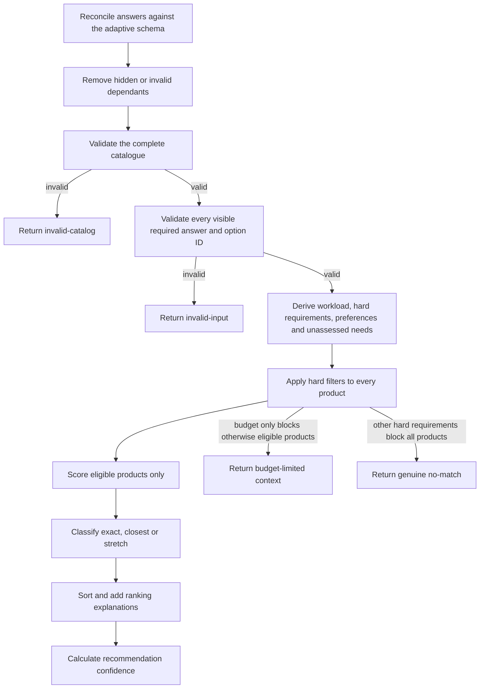

# Northstar v1.1 recommendation algorithm

| Versioned concern | Value |
| --- | --- |
| Application | `1.1.0` |
| Questionnaire schema | `2` |
| Recommendation rules | `2.0.0` |

These values are independent. A wording or interface release does not silently change questionnaire
compatibility or recommendation rules.

Northstar separates sourced facts from project-authored assessments. Product prices, hardware and
source URLs live in `js/products.js`; thresholds, capability bands, matrices, fit scores and
confidence logic are Northstar decisions, not Apple recommendations or performance claims.

## Processing flow



## Adaptive input and hidden-answer safety

Question definitions have stable IDs, answer paths, required/optional status, options and explicit
visibility rules. One or two primary uses are allowed. Selecting a use reveals its workload
follow-up; demanding-use families can also reveal sustained-duration detail.

Every answer change is reconciled against the new visible question set. Answers whose triggering
condition no longer holds are cleared, reported by question ID and excluded from validation,
profile derivation and scoring. A stale hidden answer is therefore an invalid input rather than a
silent ranking signal.

The v1.0 compatibility helper deliberately maps only unambiguous concepts. Changed concepts such as
the former compact/large screen grouping, global workload intensity and combined video/3D use are
flagged for review instead of being guessed.

## Workload derivation

Each selected primary use supplies a baseline capability and memory signal. Visible workload-detail,
multitasking and sustained-duration answers may raise those targets. The derived profile takes the
strongest applicable capability and memory signals rather than averaging away a demanding need.

Workload targets are preferences by default. They become hard minimum capability and verified-memory
requirements only when the visitor explicitly chooses the mandatory workload option.

## Hard eligibility requirements

All products must pass availability, `GB`/`GBP`, complete-data and valid internal chip-mapping checks.
Visitor answers add only the hard requirements shown below.

| Answer | Hard-filter condition |
| --- | --- |
| Budget | Strict target, or the absolute maximum supplied for flexible/stretch mode |
| Storage | Known selected minimum; `unsure` adds no storage threshold |
| Workload/memory | Only when workload treatment is `mandatory` |
| Weight | Only when marked `must-not-exceed` |
| Screen size | Only when marked `exact-size-required` |
| External displays | Only when marked `must-support`; the fact is verified in the catalogue |
| Ownership headroom | Only when explicitly marked essential; this is a Northstar assessment |

Memory, weight, screen size and ownership period are not automatic hard filters. Battery and
connection answers never become filters because the current catalogue lacks verified model-specific
battery-runtime and port-inventory facts.

## Budget modes and no-match handling

- **No fixed target:** budget does not filter or classify a product as stretch.
- **Strict:** the preferred target is the hard maximum.
- **Flexible:** the optional absolute maximum is the hard boundary. Products within the preferred
  target form the primary list; eligible products above it form a separate stretch list.
- **Stretch:** the optional absolute maximum remains hard. Eligible over-target products may join
  the primary list but receive a five-point ranking adjustment, so they need at least five points of
  stronger fit to outrank an otherwise comparable within-target option.

If budget is the only blocker, the engine returns `budget-limited` plus unranked context. If other
hard requirements make every configuration ineligible, it returns a genuine `no-match`. It never
silently relaxes a requirement.

## Scoring

| Component | Weight | Source |
| --- | ---: | --- |
| Workload | 25 | Derived workload band × product capability band |
| Primary uses | 20 | Average of one or two use/capability fits |
| Multitasking and memory | 15 | Derived memory target × verified memory band |
| Portability and weight | 15 | Portability/performance blend, plus optional weight fit |
| Screen size | 10 | Exact/nearby marketed-size fit; omitted for no preference |
| Ownership period | 10 | Northstar headroom fit; omitted when unsure |
| External displays | 5 | Verified display-count fit; omitted for none/unsure |

The workload matrix retains the v1.0 right-sizing correction: higher capability is not automatically
a perfect fit for light/moderate work, while explicit performance-first and demanding workloads can
still favor higher bands.

Portability/performance is blended from the verified product weight band and Northstar capability
band. If a weight target is supplied, 70% of this component comes from the selected
portability/performance balance and 30% from target-weight fit.

An inapplicable component has zero applied weight. The normalized score is:

```text
score = sum(component value × configured weight) / sum(applied weights)
```

Scores are stored as integer basis points and exposed as percentages up to 100.

## Result classifications

- **Stretch-budget match:** verified price is above the preferred target but within the permitted
  boundary.
- **Exact match:** within target, every applied component is at least 70, no major compromise is
  present and there is no unassessed must-have connection.
- **Closest match:** passes every hard requirement but has an applied component below 70, a major
  compromise or an unassessed must-have connection.

Classifications describe Northstar's match model, not Apple product categories.

## Reasons, compromises and lower-rank explanations

Reasons combine verified hard-requirement evidence with strong scored preferences. Evidence is
explicitly labelled as either a verified fact or Northstar assessment.

Compromises identify weak applied components, requirements met without headroom and prices using at
least 90% of a finite target. Lower-ranked matches include the deciding sort factor, largest deficit
against the leader and any material component advantage.

Ordering is deterministic by budget-adjusted ranking basis points, total score, workload, primary
uses, multitasking/memory, portability/weight, screen, ownership, displays, fewer compromises, lower
verified price and stable product ID.

## Confidence calculation

Confidence is a documented property of the recommendation evidence, not a probability that a person
will like a product.

| Contribution | Maximum |
| --- | ---: |
| Answered applicable workload detail | 40 |
| Leading fit score | 30 |
| Separation from the second match | 20 |
| Exact/closest/stretch alignment | 10 |

Fit contributes 30 points at 85+, 22 at 75–84.99 and 12 at 65–74.99. Separation contributes 20
points for an 8+ point lead, 14 for 4–7.99, 8 for a smaller positive lead and 4 for a tie; a sole
eligible product receives 10. Alignment contributes 10 for exact, 6 for closest and 2 for stretch.

Labels are High 80–100, Moderate 55–79 and Low 0–54. A full-day or long-travel battery need caps
confidence at Moderate because runtime cannot be evaluated. An unassessed must-have connection caps
confidence at Low. Non-`ok` outputs have zero points and a Low label.

## Unassessed answers

Battery importance and specific connection needs remain in the result input snapshot so the UI can
explain that they were collected but not ranked. They do not change eligibility, component scores or
ordering. This preserves the no-inference rule while leaving a compatible path for a future verified
dataset.

## Output contract

The pure engine returns one of:

- `ok`: primary and/or stretch recommendations are available;
- `budget-limited`: otherwise eligible configurations exceed the permitted maximum;
- `no-match`: one or more non-budget hard requirements block every product;
- `invalid-input`: visible answers or IDs fail validation; or
- `invalid-catalog`: the full catalogue fails validation.

Outputs contain an immutable input/profile snapshot, matches, separate stretch matches, exclusions,
budget-limited alternatives, tie groups, hard-filter diagnostics, category counts, confidence,
unassessed-answer disclosures and ranking explanations. Repeated calls with identical validated
inputs are deterministic and do not mutate their arguments.
