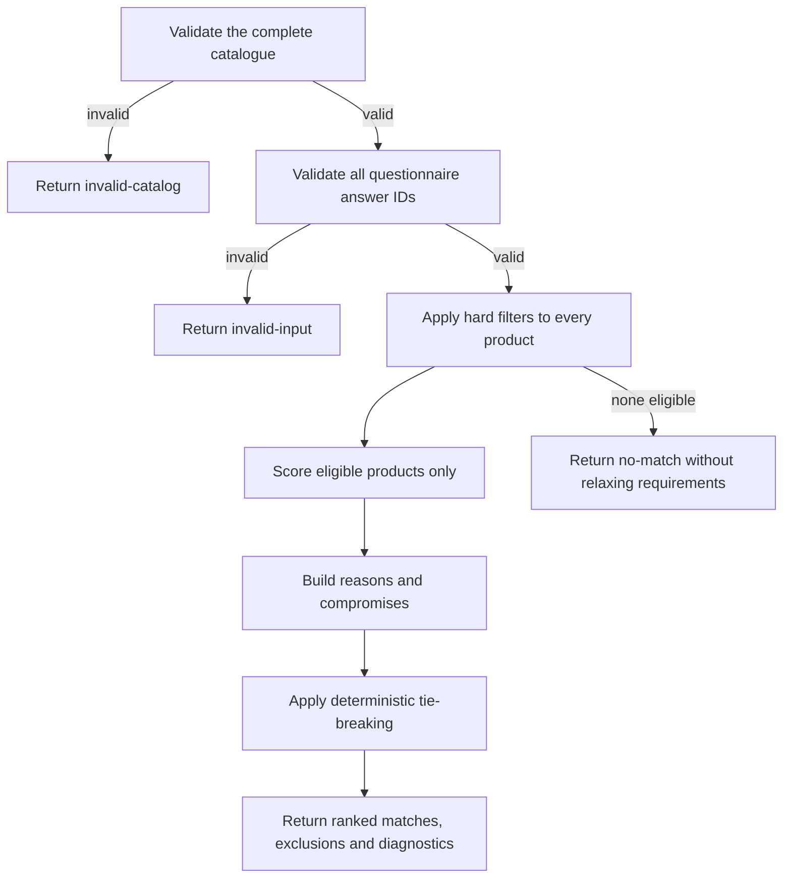

# Northstar recommendation algorithm

Rules version: `1.1.0`

Northstar separates sourced facts from project-authored suitability judgements. Product prices,
hardware and source URLs live in `js/products.js`; all thresholds, capability bands and matrices in
`js/recommendation-rules.js` are independent Northstar decisions, not Apple recommendations or
performance claims.

## Processing flow



## Catalogue and input validation

The complete catalogue must pass before any recommendation is calculated. Validation covers the
catalogue schema, stable IDs, market, currency, ISO dates, official Apple UK URLs, required fields,
source coverage and duplicate IDs. Accepted catalogue data is deeply frozen.

Questionnaire input must contain one known answer ID for each question, except `primaryUses`, which
must contain one or two unique known IDs. Invalid input produces no matches.

## Hard eligibility filters

A product is excluded when any of these checks fail:

1. It is not marked available.
2. It is not a `GB`/`GBP` record.
3. A recommendation-critical fact is `null` or unavailable.
4. Its verified price exceeds the selected finite budget.
5. Its storage is below the selected minimum.
6. Its supported external-display count is below the selected minimum.
7. Its Northstar capability band is below the workload minimum.

“Flexible” or “unsure” removes only the related optional threshold; it does not invent a value or
silently soften another requirement.

## Capability bands and right-sizing

Northstar assigns four internal capability bands to the catalogue chip IDs. Bands are a compact
project model used for matching and are not benchmarks.

The Stage 4 audit found a reproducible right-sizing defect: a flexible-budget visitor with everyday
light/moderate work and a balanced portability/performance preference received a £4,099 M5 Max as
the first result. Higher bands had identical perfect workload scores, so small capability gains
outweighed a much more proportionate Air match.

Rules `1.1.0` correct that defect by treating extra capability as a weaker workload fit for light and
moderate work while retaining maximum capability for visitors who explicitly select
performance-first.

| Workload | Band 1 | Band 2 | Band 3 | Band 4 |
| --- | ---: | ---: | ---: | ---: |
| Light | 100 | 100 | 85 | 70 |
| Moderate | 40 | 100 | 95 | 85 |
| Demanding | 0 | 55 | 100 | 100 |
| Very demanding | 0 | 0 | 70 | 100 |

The hard minimum remains separate: a score can describe a weaker fit only after a product passes
eligibility.

## Weighted scoring

| Component | Weight | Source of score |
| --- | ---: | --- |
| Workload | 30 | Workload matrix × capability band |
| Primary uses | 25 | Average of one or two primary-use matrix values |
| Portability/performance | 20 | Selected blend of weight band and capability band |
| Screen size | 15 | Compact/large match; omitted for no preference |
| Ownership period | 10 | Headroom matrix; omitted when unsure |

Portability/performance uses this formula:

```text
portability score = portability band / 5 × 100
performance score = capability band / 4 × 100
component score = portability score × selected portability share
                + performance score × selected performance share
```

The selected shares run from `1 / 0` for portability-first to `0 / 1` for performance-first.
Balanced uses `0.5 / 0.5`.

## Normalization

An optional component with “unsure” or “no preference” has `null` value and zero applied weight. The
engine normalizes over the remaining weights:

```text
score = weighted points / applicable weight × 100
```

Scores are stored as integer basis points and exposed as a percentage with at most two decimal
places. The score cannot exceed 100.

Example: if screen size and ownership are omitted, the applicable weight is `30 + 25 + 20 = 75`.
A product earning 30, 25 and 15 weighted points scores `70 / 75 × 100 = 93.33`.

## Reasons and compromises

Reasons include both hard-requirement evidence and the strongest scored preferences. Stage 4
reserves up to two of the three reason slots for strong preference components, preventing hard
filter confirmations from hiding the factors that explain rank.

Compromises identify applied component scores below 70, requirements met without headroom, or a
price using at least 90% of a finite budget. Reasons and compromises are deterministic structured
objects with evidence, not marketing copy.

## Deterministic ordering

Eligible matches are ordered by:

1. total score basis points;
2. workload component;
3. primary-use component;
4. portability/performance component;
5. fewer compromises;
6. lower verified price; and
7. lexicographic stable product ID.

Equal-score groups are also returned in diagnostics. The engine does not mutate inputs and repeated
calls with identical validated data produce identical output.

## Output contract

The engine returns one of four statuses:

- `ok`: one or more ranked matches;
- `no-match`: every product failed at least one hard rule;
- `invalid-input`: questionnaire IDs or structure are invalid; or
- `invalid-catalog`: the catalogue failed validation.

Every output includes catalogue metadata, a frozen input snapshot, matches, exclusions, tie groups
and diagnostic counts. A no-match response contains blockers but never a silently relaxed near
match.
