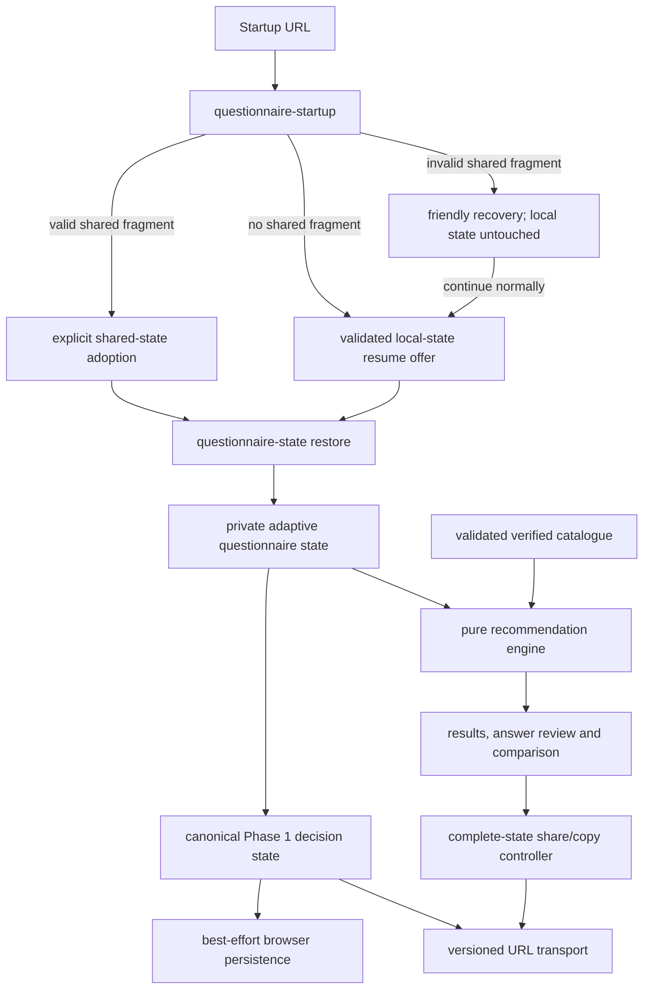

# Northstar v1.2 architecture

Status: v1.2 release-candidate architecture on `feature/shareable-results-v1.2`; not merged,
released or deployed

Northstar is a static, framework-free browser application. Version 1.2 adds portable questionnaire
decision state around the existing v1.1 recommendation system while keeping product data, rules,
calculation, persistence, transport and rendering as separate concerns.

## Runtime flow

Recommendations, scores, confidence, selected product IDs and catalogue records flow from the
engine to results rendering only. They do not flow into serialization, browser storage or URLs.

## Module boundaries

| Boundary | Primary module(s) | Responsibility |
| --- | --- | --- |
| Version metadata | `js/version.js`, `js/questionnaire-url.js` | Independent application, questionnaire, state, transport and rules versions |
| Questionnaire definition | `js/questionnaire-definition.js` | Stable question/control/option IDs, visibility and selection rules |
| Adaptive profile | `js/questionnaire-profile.js` | Visibility, reconciliation, validation and derived needs |
| Private state | `js/questionnaire-state.js` | Immutable snapshots, transitions, editing, completion and validated restore |
| Canonical state | `js/questionnaire-serialization.js` | Strict partial/complete validation, canonical JSON and size limits |
| Local persistence | `js/questionnaire-persistence.js` | Best-effort save/load/clear using one namespaced browser key |
| Startup precedence | `js/questionnaire-startup.js` | Resolve recognized URL state before any local-state decision |
| URL transport | `js/questionnaire-url.js` | Versioned base64url fragment encoding/decoding and canonical URL construction |
| Questionnaire UI | `js/questionnaire.js` | Adaptive rendering, resume/adoption/recovery controls and focus/status behavior |
| Product facts | `js/products.js`, `js/product-schema.js` | Verified catalogue records and whole-catalogue validation |
| Recommendation rules | `js/recommendation-rules.js` | Project-authored thresholds, matrices and weights |
| Recommendation engine | `js/recommendation-engine.js` | Pure deterministic filtering, scoring, classification and explanation |
| Results | `js/results.js` | Recommendation cards, answer review, editing and comparison |
| Share UI | `js/results-share.js` | Complete-state eligibility, existing exporter use, Clipboard API and manual fallback |
| Application orchestration | `js/app.js` | Connect startup, state, persistence, calculation, results and sharing |

## Trust boundaries

Browser storage and URL fragments are untrusted input. They pass through encoded/decoded size
bounds and the same Phase 1 allowlist validator before private state restoration. Unknown fields,
IDs, types, versions, stale dependencies, unsafe prototypes and impossible adaptive combinations
are rejected rather than merged or guessed.

Validated state contains only stable decision IDs and compatibility metadata. Labels and all
display text resolve from internal definitions or static trusted markup. A payload string is never
rendered as HTML.

## Independent versions

| Concern | Release-candidate value | Changes when |
| --- | --- | --- |
| Application/package | `1.2.0` | The released application changes |
| Questionnaire schema | `3` | Stable question/option meanings or compatibility change |
| Questionnaire-state schema | `1` | The canonical persisted/shared envelope changes |
| URL transport | `1` | Fragment structure or encoding changes |
| Recommendation rules | `2.1.0` | Filtering, weighting, ranking or classification changes |

Version 1.2 does not increment questionnaire schema 3 or rules 2.1 because it does not change their
meaning or recommendation behavior.

## Deployment and dependencies

Relative static assets and preservation of the current pathname make both local-root and
`/apple-product-recommender/` GitHub Pages deployment work without server routing. URL state lives in
the fragment. Browser storage is origin-scoped and uses `northstar.questionnaire-state.v1`.

Production has no framework or runtime package dependency. Playwright remains exact-version,
development-only test tooling and is excluded from the Pages artifact.
