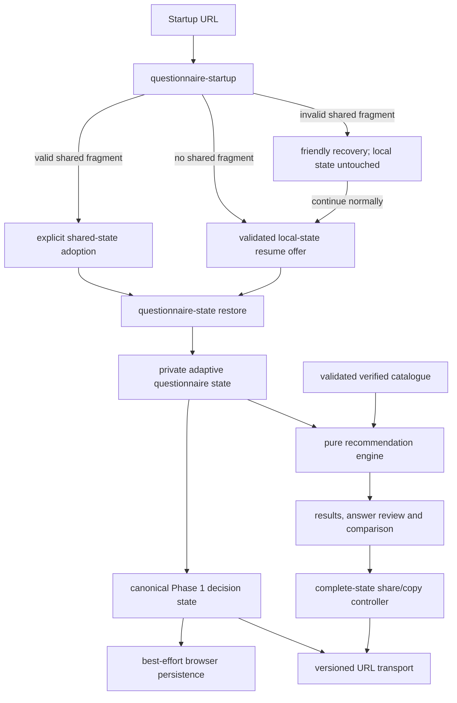
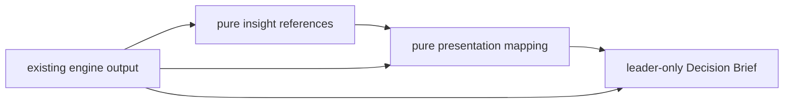

# Northstar v1.2 architecture

Status: v1.2.0 production architecture, merged into `main` and deployed through GitHub Pages

Northstar is a static, framework-free browser application. Version 1.2 adds portable questionnaire
decision state around the existing v1.1 recommendation system while keeping product data, rules,
calculation, persistence, transport and rendering as separate concerns.

## Runtime flow

```mermaid
flowchart TD
  U["Startup URL"] --> S["questionnaire-startup"]
  S -->|"valid shared fragment"| I["explicit shared-state adoption"]
  S -->|"no shared fragment"| L["validated local-state resume offer"]
  S -->|"invalid shared fragment"| F["friendly recovery; local state untouched"]
  I --> R["questionnaire-state restore"]
  L --> R
  F -->|"continue normally"| L
  R --> Q["private adaptive questionnaire state"]
  Q --> P["canonical Phase 1 decision state"]
  P --> B["best-effort browser persistence"]
  P --> T["versioned URL transport"]
  Q --> E["pure recommendation engine"]
  C["validated verified catalogue"] --> E
  E --> V["results, answer review and comparison"]
  V --> H["complete-state share/copy controller"]
  H --> T
```

Recommendations, scores, confidence, selected product IDs and catalogue records flow from the
engine to results rendering only. They do not flow into serialization, browser storage or URLs.

## Module boundaries

| Boundary | Primary module(s) | Responsibility |
| --- | --- | --- |
| Version metadata | `js/version.js`, `js/questionnaire-url.js` | Independent application, questionnaire, state, transport and rules versions |
| Questionnaire definition | `js/questionnaire-definition.js` | Stable question/control/option IDs, visibility and selection rules |
| Adaptive profile | `js/questionnaire-profile.js` | Visibility, reconciliation, validation and derived needs |
| Private state | `js/questionnaire-state.js` | Immutable snapshots, transitions, editing, completion and validated restore |
| Canonical state | `js/questionnaire-serialization.js` | Strict partial/complete validation, canonical JSON and size limits |
| Local persistence | `js/questionnaire-persistence.js` | Best-effort save/load/clear using one namespaced browser key |
| Startup precedence | `js/questionnaire-startup.js` | Resolve recognized URL state before any local-state decision |
| URL transport | `js/questionnaire-url.js` | Versioned base64url fragment encoding/decoding and canonical URL construction |
| Questionnaire UI | `js/questionnaire.js` | Adaptive rendering, resume/adoption/recovery controls and focus/status behavior |
| Product facts | `js/products.js`, `js/product-schema.js` | Verified catalogue records and whole-catalogue validation |
| Recommendation rules | `js/recommendation-rules.js` | Project-authored thresholds, matrices and weights |
| Recommendation engine | `js/recommendation-engine.js` | Pure deterministic filtering, scoring, classification and explanation |
| Results | `js/results.js` | Recommendation cards, answer review, editing and comparison |
| Share UI | `js/results-share.js` | Complete-state eligibility, existing exporter use, Clipboard API and manual fallback |
| Application orchestration | `js/app.js` | Connect startup, state, persistence, calculation, results and sharing |

## Trust boundaries

Browser storage and URL fragments are untrusted input. They pass through encoded/decoded size
bounds and the same Phase 1 allowlist validator before private state restoration. Unknown fields,
IDs, types, versions, stale dependencies, unsafe prototypes and impossible adaptive combinations
are rejected rather than merged or guessed.

Validated state contains only stable decision IDs and compatibility metadata. Labels and all
display text resolve from internal definitions or static trusted markup. A payload string is never
rendered as HTML.

## Independent versions

| Concern | v1.2.0 value | Changes when |
| --- | --- | --- |
| Application/package | `1.2.0` | The released application changes |
| Questionnaire schema | `3` | Stable question/option meanings or compatibility change |
| Questionnaire-state schema | `1` | The canonical persisted/shared envelope changes |
| URL transport | `1` | Fragment structure or encoding changes |
| Recommendation rules | `2.1.0` | Filtering, weighting, ranking or classification changes |

Version 1.2 does not increment questionnaire schema 3 or rules 2.1 because it does not change their
meaning or recommendation behavior.

## Deployment and dependencies

Relative static assets and preservation of the current pathname make both local-root and
`/apple-product-recommender/` GitHub Pages deployment work without server routing. URL state lives in
the fragment. Browser storage is origin-scoped and uses `northstar.questionnaire-state.v1`.

Production has no framework or runtime package dependency. Playwright remains exact-version,
development-only test tooling and is excluded from the Pages artifact.

## v1.3 Decision Brief integration (local implementation)

The approved first Decision Clarity phase adds `js/recommendation-insights.js`. Its
`buildRecommendationInsights({ output, catalogue })` function consumes an existing engine result
and the same validated catalogue, returning deeply frozen evidence references and insight selectors.
It separates user answers, derived needs, verified catalogue facts and Northstar assessments without
changing the engine, profile, rules, questionnaire or any persistence/URL boundary.

The builder retains engine reasons, passed requirements, compromises and confidence. Runner-up
comparison is restricted to the second candidate in the selected result group; contextual fact pairs
cannot independently explain ranking. Terminal outcomes contain no fabricated evidence or advice.
Explicit ordering, provenance and failure behavior are documented in
[recommendation-insights.md](recommendation-insights.md).

PR #7 records the pure layer's integration history. The separately approved visible phase adds
`js/recommendation-insight-presentation.js`, a pure, deeply frozen presentation mapping. It resolves
existing annotation messages from the same engine output and labels/source records from the
question definitions and catalogue. Neither downstream module invokes the engine or derives needs.

For each eligible calculation, `app.js` builds insights and the presentation model, then passes the
model to `results.js`. Only the identified leader receives **Why this fits**, before its full facts.
The leader's existing reasons/considerations move into the brief; secondary cards, comparison,
confidence details and answer review retain their existing presentation. A native closed disclosure
contains retained explanations and their supporting evidence. No new independent cache exists.

```mermaid
flowchart LR
  E["existing engine output"] --> I["pure insight references"]
  I --> P["pure presentation mapping"]
  E --> P
  P --> R["leader-only Decision Brief"]
  E --> R
```

Only insight/presentation construction is caught if it fails; valid recommendations still render
their existing reasons and compromises. Calculation and DOM rendering remain outside that catch.
Editing, restoration and shared-state adoption rebuild the brief through the same calculation flow.
It never enters storage, serialization or URL transport. This branch is local and uncommitted;
the production architecture and version metadata above remain the released v1.2.0 baseline.
